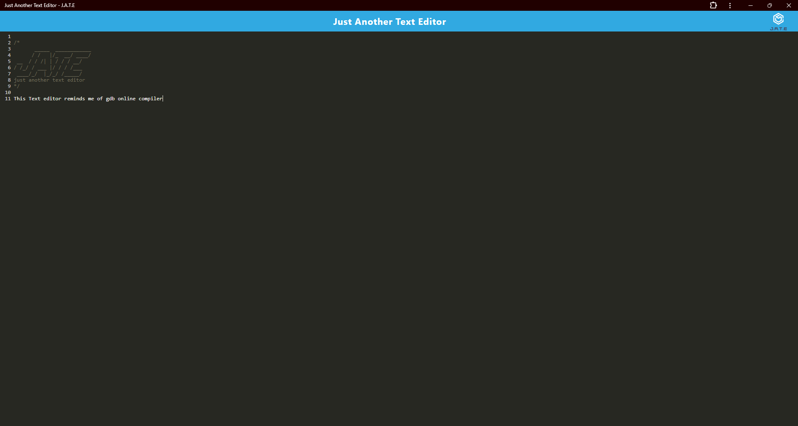

# 19 Progressive Web Application (PWA): Text Editor

# Online thoughts app

github: https://github.com/DannySanchez03/19ModChallenge

## Description

In this Module 19 Challenge we were told to clone a github repository and implement the functionalitys of the todo's comments inside of the client folder files. This app is a text editor that can work offline, it can also be installed from your browser.

## Installation

I was having trouble deploying this application on render, this is what ended up showing up on the console.
After checking if the port being 3000 I switched it on the server.js file, I ended up trying 4000 becuase I had looked at the documentation and that didnt solve the problem. It would be nice if I can get some feedback towards why my app isn't being deployed.

## Usage

N/A

## Credits

N/A

## License

MIT License

Copyright (c) 2023 DannySanchez03

Permission is hereby granted, free of charge, to any person obtaining a copy
of this software and associated documentation files (the "Software"), to deal
in the Software without restriction, including without limitation the rights
to use, copy, modify, merge, publish, distribute, sublicense, and/or sell
copies of the Software, and to permit persons to whom the Software is
furnished to do so, subject to the following conditions:

The above copyright notice and this permission notice shall be included in all
copies or substantial portions of the Software.

THE SOFTWARE IS PROVIDED "AS IS", WITHOUT WARRANTY OF ANY KIND, EXPRESS OR
IMPLIED, INCLUDING BUT NOT LIMITED TO THE WARRANTIES OF MERCHANTABILITY,
FITNESS FOR A PARTICULAR PURPOSE AND NONINFRINGEMENT. IN NO EVENT SHALL THE
AUTHORS OR COPYRIGHT HOLDERS BE LIABLE FOR ANY CLAIM, DAMAGES OR OTHER
LIABILITY, WHETHER IN AN ACTION OF CONTRACT, TORT OR OTHERWISE, ARISING FROM,
OUT OF OR IN CONNECTION WITH THE SOFTWARE OR THE USE OR OTHER DEALINGS IN THE
SOFTWARE.
